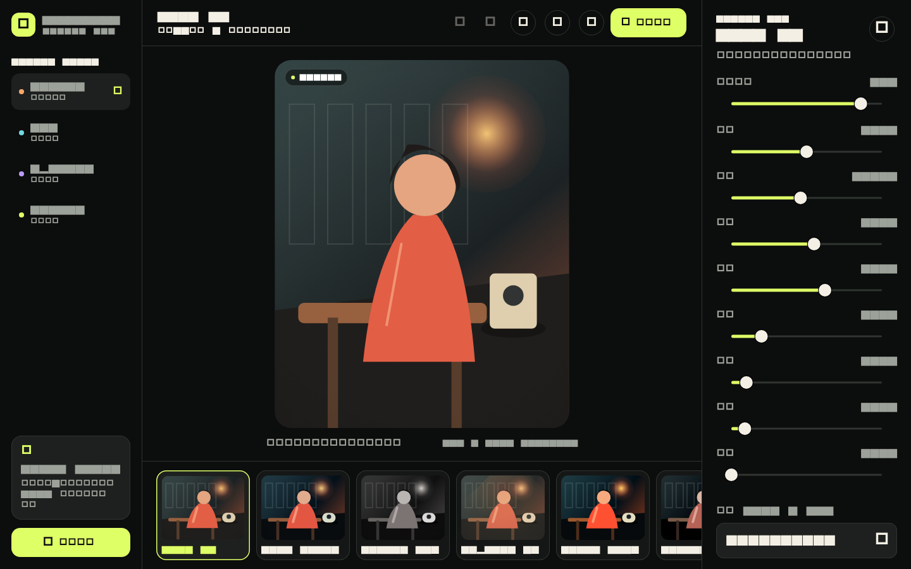
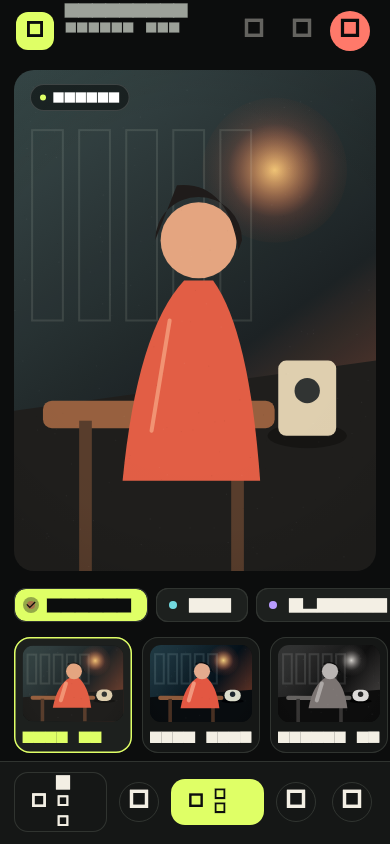

# Unflatten Studio

Unflatten Studio 是一款开源、本地优先、跨平台的语义图像创作与虚拟相机工作台。

当前开发重点是 Camera Lab：用户可以导入图片、浏览 24 台虚拟相机、调节 Camera DNA 参数，并使用固定 Seed 复现颗粒、漏光和缺陷签名。

## 桌面与移动端




> 截图由 `flutter test --update-goldens` 生成，存放在 `test/goldens/`。修改界面后请同步更新视觉基线。

## 当前能力

- Web、iOS、Android、macOS、Windows、Linux 共用一套 Flutter 工程。
- Analog、Y2K Digicam、Optical、Mobile Eras 四个相机包。
- 24 台内置虚拟相机。
- Camera Contact Sheet 试拍表。
- 曝光、对比、饱和、冷暖、颗粒、暗角、Bloom 和闪光调校。
- 可手动编辑 Hex Seed 的可复现缺陷签名。
- 本地图像导入。
- 移动端与电脑端自适应工作区。
- 最多 32 步撤销/重做，滑块一次拖动只生成一个历史步骤。
- PNG 导出：Web 直接下载、桌面系统保存、移动端系统分享。
- `.ucamera` JSON 复制与开放格式模型。
- Rust 配方校验与确定性解析核心。

## 项目结构

```text
lib/
  app/                         应用入口与路由
  core/                        主题和跨功能基础设施
  features/camera_lab/         Camera Lab 领域、状态和界面
native/
  crates/unflatten_recipe/     Rust 相机配方核心
  crates/unflatten_core/       原生核心统一入口
docs/
  PRODUCT_SPEC.md              产品规格
  ARCHITECTURE.md              技术架构
test/                          单元、Widget 与视觉基线测试
```

## 本机开发

本仓库不强制把 Flutter 或 Rust 写入全局 PATH。开发脚本会优先使用标准工具链；在当前开发机上，会回退到 `~/Library/Caches/unflatten-dev`。

```bash
./tool/flutterw pub get
./tool/flutterw analyze
./tool/flutterw test
./tool/flutterw run

# 浏览器试用
./tool/serve-web.sh

./tool/cargow fmt --all
./tool/cargow test --workspace
```

中国大陆网络环境可以显式覆盖镜像：

```bash
PUB_HOSTED_URL=https://pub.flutter-io.cn \
FLUTTER_STORAGE_BASE_URL=https://storage.flutter-io.cn \
./tool/flutterw pub get
```

## 设计原则

1. 核心编辑离线可用，素材默认不上传。
2. 所有调整非破坏、可解释、可撤销。
3. 相同图片、配方和 Seed 在不同设备上保持一致。
4. 移动端优化拍摄、选择和快速调校。
5. 电脑端优化精细控制、比较和批量处理。
6. 官方配方不使用真实相机或胶片品牌名称。

## 开发路线

- v0.1：Camera Lab、24 台虚拟相机、跨端工作区。
- v0.2：IntentSplit、主体移动、背景补全和 OpenRaster。
- v0.3：阴影、反射、附属物关系和 Truth Map。
- v0.4：World Filter、环境光和安全运镜。
- v0.5：视频相机滤镜与时间维度缺陷。

详细范围参见 `docs/PRODUCT_SPEC.md`，跨端边界参见 `docs/ARCHITECTURE.md`。

## 平台支持

| 平台 | 状态 |
|---|---|
| macOS | 桌面端，已验证 |
| Windows | 桌面端，工程模板就绪 |
| Linux | 桌面端，工程模板就绪 |
| iOS | 工程模板就绪，需 Xcode 全量安装 |
| Android | 工程模板就绪，需 Android SDK |
| Web | 已验证，可直接本地运行与导出 PNG |

## 持续集成

每个 PR 与 push 都会跑：

- `flutter analyze`
- `flutter test`（单元、Widget、视觉基线、perf benchmark）
- `cargo fmt --all -- --check`
- `cargo test --workspace`

矩阵覆盖 `ubuntu-latest` 与 `macos-latest`。

## 真机构建预检

第一次跑 `flutter build <platform>` 之前，先用预检脚本确认工具链：

```bash
./tool/verify-build.sh all         # 检查所有平台
./tool/verify-build.sh ios         # 只检查 iOS
./tool/verify-build.sh android     # 只检查 Android
./tool/verify-build.sh macos       # 只检查 macOS
./tool/verify-build.sh windows     # 只检查 Windows
./tool/verify-build.sh linux       # 只检查 Linux
```

预检脚本会顺带跑 analyze + test 确认代码干净。

## 上手文档

- [`docs/QUICKSTART.md`](docs/QUICKSTART.md)：克隆到运行 5 步。
- [`docs/USER_GUIDE.md`](docs/USER_GUIDE.md)：**面向最终用户的使用指南**（导入图片 / 选相机 / 调参数 / 撤销 / 导出 / Seed 复现）。
- [`docs/RECIPE_FORMAT.md`](docs/RECIPE_FORMAT.md)：`.ucamera` 配方字段表与扩展方式。
- [`docs/PUSH.md`](docs/PUSH.md)：推送远端与认证方式指南。
- [`docs/PRODUCT_SPEC.md`](docs/PRODUCT_SPEC.md)：产品定位、功能范围与原则。
- [`docs/ARCHITECTURE.md`](docs/ARCHITECTURE.md)：模块边界、状态流与目录说明。

## 许可

本项目使用 [Apache License 2.0](LICENSE)。

## 致谢

Camera DNA 五模块设计的灵感来自银盐胶片、CCD 数码相机与现代手机摄影的视觉语言，但本仓库刻意避免使用真实品牌、相机或胶片型号的名称。所有 24 台内置相机都是化名配方。
